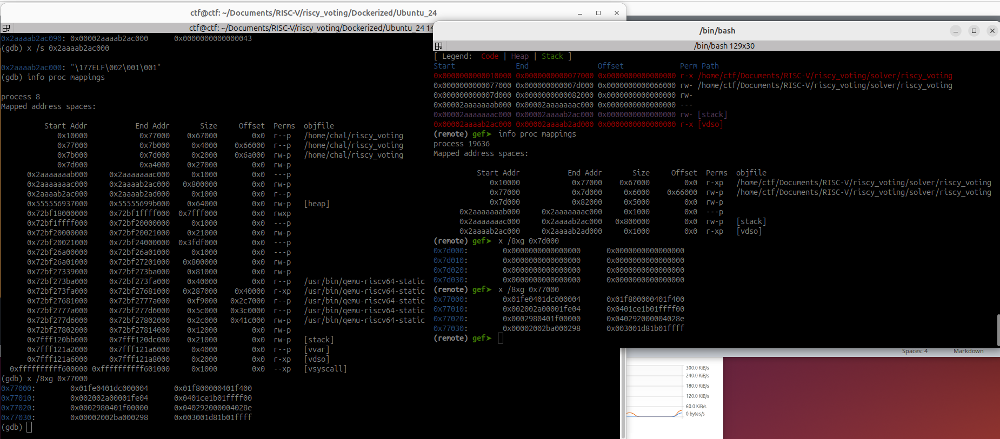
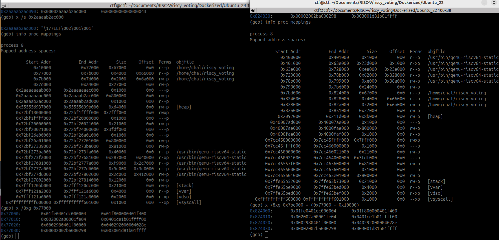
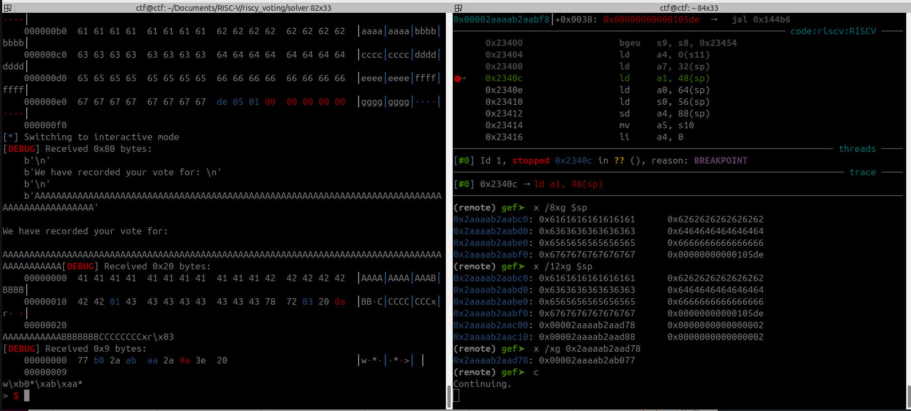
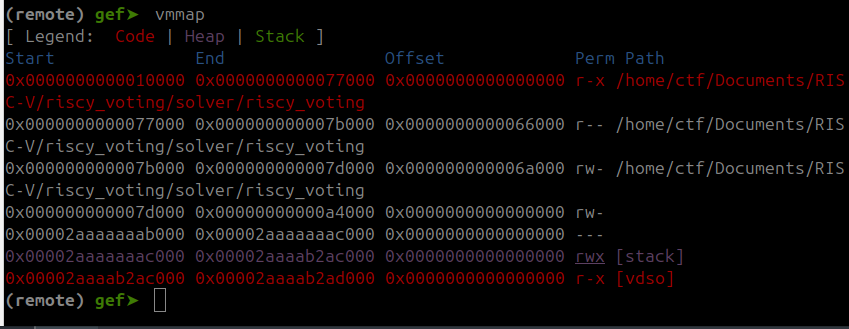
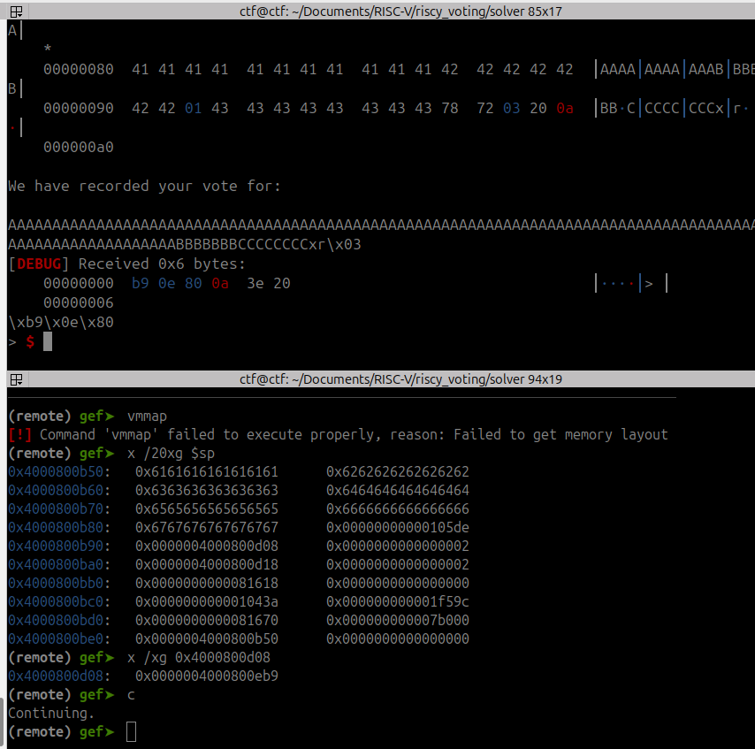
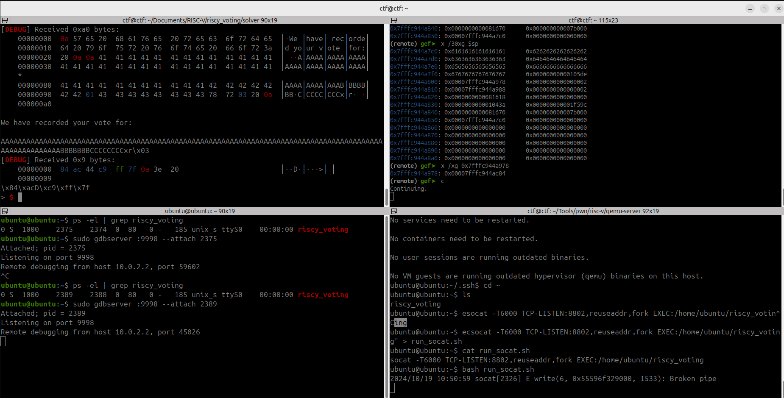
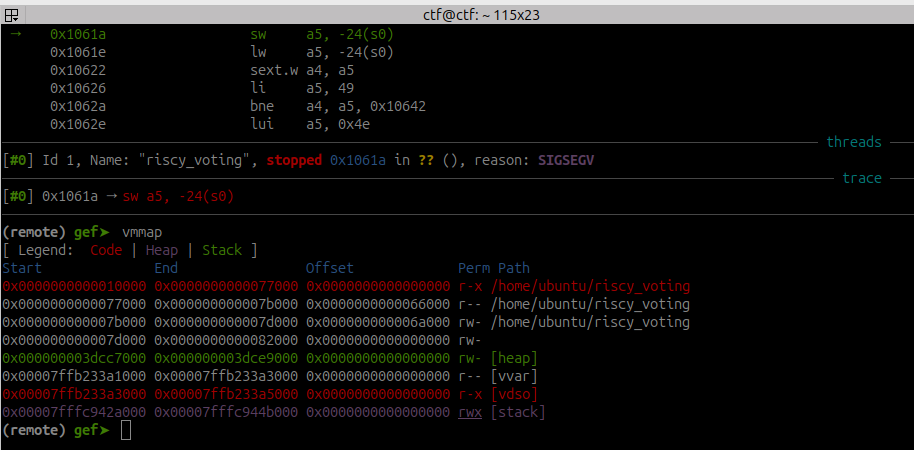

# Riscy Voting

This challenge is a 64-bit RISC-V ROP challenge. The flavortext is a voter casting a ballot in the 2048 U.S. election from Mars via satellite relay. Finding the vulnerability is easy (simple buffer overflow), the hardest part is exploiting it. 

The binary is statically linked, making gadgets prevalent, but it's stripped of symbols. People will need a little proficiency in Ghidra to find the vulnerability and ignore the rest of the noise. PIE is disabled, putting the functions in predictable locations. That's important because we don't give them a format string exploit to leak information from memory prior to the buffer overflow. 

I borrowed heavily from the deployment for RISC-V challenges in the 2023 Hack-A-Sat quals. Those challenges run with `qemu-user` in Docker containers. A section in this write-up talks about how players would go about debugging that.

## The vulnerability

The `run_challenge` function passes a buffer of size 104 to the `get_write_in` function, which reads a large buffer (600 bytes). That sets up the opportunity for a ROP chain.

## How ROP chains work in RISC-V

The topic is relatively new. [Here](https://github.com/nikosChalk/ctf-writeups/tree/master/hack-a-sat-23/pwn/dROP-Baby) is a CTF write-up for 32-bit ROP chains in RISC-V, and [this blog](https://infosecwriteups.com/return-oriented-programming-on-risc-v-part-1-dd9817b52d2b?gi=9151d35d38fc) lays out the theory with useful diagrams. [Here](https://arxiv.org/pdf/2007.14995#subsection.1.1) is a useful academic article from 2020 on the topic, and it goes into the concept of self-modifying ROP chains that I ended up referencing to write the solution for this challenge. 

ROP for RISC-V is harder than for x86-64, and not just because people tend to learn x86-64 first. First, the [`ROPGadget`](https://pypi.org/project/ROPGadget/) tool supports finding gadgets for 64-bit RISC-V, but does not automatically generate ROP chains at the time of this writing. `ROPGadget` also does not support 32-bit RISC-V, although 64-bit RISC-V is more prevalent and so this challenge is for 64-bit RISC-V. 

Tooling aside, ROP for RISC-V is also different than x86-64 in a few fundamental ways that make ROP harder for humans to write ROP chains. Unlike x86-64, where jumps to addresses "in between" consecutive instructions in the dissembled binary can generate gadgets containing instructions that were not part of a dump of the original binary at all, for "regular" RISC-V-64 all instructions must appear at offsets that are multiples of 4, although a "compressed" form of RISC-V allows for two-byte instructions and thus the present binary requires instructions to be at offsets that are multiples of 2. The effect is that the gadgets by and large contain instructions that actually appear in the disassembly. RISC-V doesn't push or pop from the stack: instead register values are saved or loaded from the stack, and so gadgets generally involve saving caller-saved registers or loading callee-saved registers. That limits the registers accessible for "popping" values from the stack. 

The return address is not on the stack to be referenced by the stack pointer during a return function. Instead, the return address is a register (usually `x1` or colloquially, `ra`, although the binary for this challenge has gadgets jumping to `a5`, `a6`, `s0` and possibly others). Some gadgets will increment the stack pointer prior to returning and others will not, so as there is no `pop` instruction that automatically increments the stack pointer, the player must craft gadgets into short mini-chains that perform some useful function, increment the stack pointer, and make sure the address of the next gadget is in the register being returned to at the end of the mini-chain. See the blogs and papers for more details about how to do this; generally speaking, crafting these mini-chains just takes a little bit of practice and intuition for how RISC-V works. 

It is harder to make use of `MOV` instructions compared to x86-64, and it's often easiest to do something specific by saving a register's value to a future section of the ROP chain and then loading the value to a different register in a future gadget. Along the same vein, getting shell via a call to `execve("/bin/sh", NULL, NULL)` however, requires having a pointer to a string in memory in the `a0` register at the time of the function call, and that involves leaking a stack address at some point during the exploit -- at least, the solution I worked out does.

## Compiling, Running and Debugging RISC-V

[This blog](https://chalkiadakis.me/posts/hack-a-sat-23/riscv-pwn/) goes into detail. Basically, download the RISC-V tool chain and get familiar with using QEMU and `gdb-multiarch` with the instruction set set to RISC-V. I used an Ubuntu 24.04 environment to solve the challenge and deployed the challenge in an Ubuntu 22.04 Docker container to make sure that people on slightly older VMs can still use the tools. The bottom line is that the tools to do this pwning are relatively cutting-edge, so players should expect to have to do a bit of work with tooling. I think that's fair game because it's not useless tooling for no reason, it's cutting-edge tools to work on an important architecture.

### Understanding memory layout locally and remotely

Knowing memory layout is essential to doing things like identifying a stable address for writing the string `/bin/sh` prior to calling `execve("/bin/sh",NULL,NULL")`. Normally this is done with commands like `info proc mappings` in `gdb` (or `vmmap` using `pwndbg`). For challenges running in Docker containers, it is possible to enter the container with `docker exec -it [container ID] /bin/sh` and then run `ps -el | grep qemu` and then connect via `gdb-multiarch -p [PID]` to the process running `qemu-riscv64-static`, then run `info proc mappings` from there. 



The above figure shows the challenge running in a Docker container, viewing `qemu-riscv64-static` (left panel) vs. running locally in an Ubuntu 24.04 development environment, connecting to the process using `pwndbg` as per the [exploit script](../solver/exploit-riscy-voting-get-shell.py) with `local` set to `True` and debugging enabled. The right panel is the debugging environment in which the user can view the RISC-V instructions that are running. In particular, `pwndbg` is set up to automatically attach itself just to the RISC-V process that QEMU is emulating and connect to that, with the architecture set to RISC-V. Fair enough, but I learned while developing this challenge that because `qemu-riscv64-static` is QEMU running in user mode, the layout of memory is OS-dependent -- which means that within and outside the Docker container, memory layout will be different and the player should not automatically trust information from their local debugging to do things like determine the location of the BSS section in memory within the Docker container.

To make sure the challenge is playable regardless of the OS the players use locally, I identified a path the players can use to determine the location of the BSS section within the Docker container. First I'll mention that the easiest way to debug an exploit within the Docker container is to run `gdbserver` within the container, run `qemu-riscv64-static` with the `-g [port]` flag set to attach a debugger, expose the debugging port and enable `PTRACE` with the Docker run command, and connect to that debugger from the outside with `target remote [port]` (see below for instructions). Doing so makes debugging easy and fast from outside the container, but however does not allow the user to view memory layout as commands like `vmmap` or `info proc mappings` do not have access to the relevant information inside the Docker container. So they have to connect to the container with `docker exec -it [container ID] /bin/sh` and go from there. In theory a player could install `pwndbg` in a Docker container and attach to the process that way to view the memory from there, but fortunately we can see that all that work isn't strictly necessary. Viewing a running `qemu-riscv64-static` process with `gdb-multiarch -p` and running `info proc mappings` is what we get on the left panel above. Comparing the left and right panels shows that we are able to map the same bytes in writable memory locally (right) to within the Docker container (left). The address offset happens to be the same but remember we're using the same OS for development as for the Docker container.

Now as a proof of concept let's repeat the process except using Ubuntu 22.04 for the Docker container. 



The left panel shows memory in the Ubuntu 24.04 Docker container, and the right panel shows the same memory in the Ubuntu 22.04 container. While `QEMU user` running on each operating system assigns the BSS sections to completely different absolute addresses (`0x7b000` for Ubuntu 24.04 and `0x828000` for Ubuntu 22.02), the BSS section starts at the same offset from the start of the `riscy_voting` binary in both cases (because the binaries have been pre-compiled in the same environment, as will be the case for the CTF). That means that during the competition, someone can always calculate the location of the BSS section by figuring out the relevant offset. The example at the bottom of each panel shows that we take the location of specific bytes in the `riscy_voting` binary in the Ubuntu 24.04 Docker container (left panel) by adding the offset of that location in the `riscy_voting` to the start of the binary running in Ubuntu 24.04 (right panel). In fact the offset from the start of the `riscy_voting` to its BSS section is the same in both cases and so the same exploit code works against an Ubuntu 22.04 docker container as against the Ubuntu 24.04 container, but we don't want players to think they just have to guess that. This approach is a way for a player to confirm that `Qemu-user-static` isn't doing anything weird to the programs' memory layout within the Docker containers, and therefore be certain of where they're writing.

Notice how stack addresses in the Ubuntu 22.04 Docker container start with 0x4000 and in the Ubuntu 24.04 Docker container they start with 0x2aaa? That means that leaking a stack address with `puts` might not work so well against that Ubuntu 22.04 Docker container, compared to the local development environment. (People will do that if they want to write `'/bin/sh'` to the stack instead of the BSS section.) Since addresses are stored on the stack in little-endian format, they'll only get the last three bytes for the Ubuntu 22.04 container. To me that's actually not a bug, it's a feature because it forces people to look at the memory map with `gdb` and realize what's going on. 

### Debugging RISC-V running in a Docker container with `QEMU-user`


I used `qemu-user-riscv64` to write and solve the challenge, and experimented a bit with `qemu-system-riscv64` (partial notes on that follow and can help with future challenge writing).

User-mode QEMU is for running cross-compiled binaries and is a quick-and-dirty way to easily run RISC-V binaries locally. It is run with a call such as `qemu-riscv64-static -g 1234 ./riscy_voting` and then, in `gdb-multiarch`, running `set arch riscv:rv64` and then `target remote :1234`. The blog referenced at the start of this section goes into more detail about how to do this with `pwnlib`. 

While working on the solver I tried to leak a stack address by loading into `a0` a pointer to a location in memory containing a stack address, and then jumping to a call to `puts`. This screenshot shows a stack address getting leaked with what I thought were `gdb` artifacts on the stack: 



The instruction at address `0x2340c` (right pane) loads into register `a0` a pointer to `0x2aaaab2ab877` before jumping to the address of `puts`. That's a stack leak as seen in the left pane. 

(Here's the memory layout): 

Here I'm running the challenge locally in a Ubuntu 24.04 VM. I can leak a stack address but it has this unusual location. On a full-on RISC-V board emulated with `qemu-system-riscv64`, the stack address starts with `0x7f`. At first I thought that the address starting with `0x00002a` must be an artifact of the debugger, but then when I ran the challenge in an Ubuntu 24.04 Docker container without any debugging, I also leaked a stack address starting with `0x00002a`. I gradually came to understand that the memory layout of a cross-compiled binary depends on the OS running `qemu-user`. That must also have to do with the fact that `qemu-user` does not emulate its own memory. It does mean that when we give players the challenge, we also must give them the Dockerfile.

The upside of this is that initially I was worried that attaching the debugger at the beginning of the runtime of the program (as is the only option with `qemu-user`) vs. attaching it to a running process was going to be an issue, as the memory layout was different. It turns out that I reached that erroneous conclusion by comparing the memory layout of an application running with `qemu-riscv64-static` in Ubuntu 24.04 and debugging enabled (my development VM) to one running with `qemu-riscv64-static` in Ubuntu 22.04 and debugging disabled (my test Docker container). The local version leaked a stack address starting with `0x00002a` and the Dockerfile didn't get a stack address at all because the pointer to a stack address must have been at a slightly different offset. I attributed the differences to the debugger putting additional pointers on the stack, when in fact the operating systems were different and that moved the locations of the pointers! I changed my Docker container to run Ubuntu 24.04 and I was then able to leak a stack address starting with `0x00002a`. 

As additional verification, let's see if I can generate the same environment with `gdb` running against an application in a Ubuntu 22.04 Docker container that I can without `gdb` running against that application. 

And it turns out yes, indeed I can! Here's the procedure:
1. Create a "debugging" Dockerfile by ending the Dockerfile with:

```
EXPOSE 7702
EXPOSE 9997

CMD ["socat","-T6000", "TCP-LISTEN:7702,reuseaddr,fork,su=chal","EXEC:/usr/bin/qemu-riscv64-static -g 9997 riscy_voting"]
```
2. Build the container and then run the container with `SYS_PTRACE` enabled so `gdbserver` can properly trace the running binary within the Docker container:
```
sudo docker run -dit --restart=always --cap-add=SYS_PTRACE -p 7702:7702 -p 9997:9997 riscy_voting_debug
```
3. Run your exploit against `localhost:7702` and make it sleep before the payload is delivered
4. Run `gdb-multiarch` and `target remote :9997` from outside the Docker container
5. Now you can debug! I found I could not run `vmmap` this way, even specifying `file riscy_voting` in `gdb-multiarch`. But looking at the stack still shows the source of the problem:



The reason I thought the stack address wasn't leaking comes down to the null bytes. The address is `0x4000800d08` (pointing to `0x4000800eb9`), and so `puts` barfs on that. Interesting. So, we can make the challenge artificially harder by deploying in an Ubuntu 22.04 Docker container. But I like keeping it in an Ubuntu 24.04 Docker container unless we think we don't have enough hard pwnables. All that debugging was educational but not super fun.

`pwndbg` turns out to use some special tricks to get the `vmmap` out of the program running in `qemu-user`. [Here's](https://unix.stackexchange.com/questions/499752/qemu-user-get-memory-maps-while-debugging-remotely) another way to get the memory mapping out of `qemu-user` running in the Docker container. I couldn't get `-mmap` to work but I could run `qemu-riscv64-static -strace riscy_voting` to see where the stack was, along with the null bytes in the middle of the address. 


## Solution

First we need to know what RISC-V instructions are necessary to produce a call to `execve('/bin/sh',NULL,NULL)`. That's straightforward enough, we use the RISC-V toolchain to compile a little C program to call that. (`system('/bin/sh'` is fast as well, but as long as the binary doesn't have `/bin/sh` anyway, I figured I'd go with the more generic `execve` call for the solution.) 

There are a bunch of blogs out there describing what the call to `execve('/bin/sh',NULL,NULL` looks like in RISC-V but here's one way to do it with RISC-V assembly:
```
    __asm("li a0,0x0068732f6e69622f\n\t"
          "sd a0, 0(sp)\n\t"
          "addi a0,sp,0\n\t"
          "li a2,0x0\n\t"
          "li a1,0x0\n\t"
          "li a7,221\n\t"
          "ecall\n\t"
          "li a7,93\n\t"
          "ecall\n\t");
```
The last two instructions gracefully exit and aren't required for the challenge.

The basic technique I used is to use `ROPgadget` on the binary and grep the output for useful gadgets. [Here](https://github.com/nikosChalk/ctf-writeups/blob/master/hack-a-sat-23/pwn/dROP-Baby/src/solution.py) is a useful CTF write-up. We notice that not all the instructions we want are available with easy-to-use gadgets. 

So, for putting a pointer to '/bin/sh' into `a0`, the assembly above loads an immediate into `a0`, stores it on the stack right where the stack pointer is, and then moves the stack pointer over to `a0`. We can't load an immediate into `a0` directly, neither is there a gadget for `addi ap, sp, 0`. So, instead we load an immediate into an `s` register, move it over to an `a` register, save the `a` register to the BSS section and then later on load the known address of '/bin/sh' in the BSS section into `a0`. We find all the relevant gadgets for that by referencing that CTF write-up, using it as inspiration for some careful grepping of the `ROPgadget` output, and then just using some creativity. For that reason most of the solver scripts should be subtly different. The [solver script](../solver/exploit-riscy-voting-get-shell.py) contains comments with the specific greps I used to find each gadget. 

Other ways to solve this challenge could include calling `open('flag.txt')`, reading it, and writing those contents to `stdout`; putting `/bin/sh` further ahead on the stack instead of in the BSS section; and calling `system('/bin/sh')` instead of `execve('/bin/sh')`. There are likely other solutions as well. Perhaps they could make the stack executable and then jump to shellcode on the stack. All of these solutions also require the use of ROP, so they don't cheese the challenge.

### Moderators may get asked the following

1. "gdb isn't playing well with RISC-V, I'm getting an error."

The common problem is probably that they're not using `gdb-multiarch` and setting their architecture to RISC-V. Learning to do that, and to work with the RISC-V toolchain, is part of the challenge.

That said, I will note that I first tried working with RISC-V in 2023 on a VM I'd had around since 2020, and it didn't work so well. I think people need `gdb` that is somewhere around version 12 (might be 11) or newer, and they can have problems running RISC-V if they've upgraded from a version that is too old. A couple of players might reach out with error messages suggesting that `gdb` is treating some registers as the wrong size (I don't remember the exact message). My solution in that circumstance was to install a fresh instance of an Ubuntu VM that is 22.04 LTS or 24.04 LTS (Kali will likely work fine). 

2. "I can't attach a debugger in my Docker container."

Learning to do this is part of the challenge, but if people are stuck then we can give them a Dockerfile halfway through the competition that is designed for debugging. See the "Dockerfile_Ubuntu_22.04_debugging" file. It is run with an instruction like this one: `sudo docker run -dit --restart=always --cap-add=SYS_PTRACE -p 7702:7702 -p 9997:9997 riscy_voting_debug`. Note the extra port mapping and capability.

3. "Do I have to use `qemu-system` to solve this challenge?"

No. But moderators and future challenge authors can enjoy the following appendix anyway.

## Point value

This is probably about 400 points. I don't want to make it harder with PIE because I want people who haven't done ROP on RISC-V before to try it. That's also why I statically linked the binary, and why the buffer available to the attacker is not smaller. I'm not sure more difficult equals more fun in this case.

## Appendix: QEMU-System: Debugging

I borrowed heavily from the deployment for RISC-V challenges in the 2023 Hack-A-Sat quals. Those challenges run with `qemu-user` in Docker containers. But they're easier than this one, and other Hack-A-Sat challenges with cross-compiled architectures, such as Spark challenges from 2020, are run with `qemu-system`. Which is better? I started with `qemu-user`. 

As I was working through the above problem I considered that it would be good to run `gdb` within the Docker container in such a way that I could attach `gdb` to an already-running process. Then I could be more confident that `gdb` itself hadn't messed with the memory mapping or somehow placed any artifacts on the stack. 

Such an approach suffers from the drawback that user-mode QEMU doesn't implement `ptrace`, which as I understand it means that `gdb` can't attach to an already-running process. That leads to scenarios like earlier in this write-up where we have to use `ptrace` to look at the full memory layout of `qemu-riscv64-static`, find `riscy_voting` within it, and calculate offsets. Additionally I was concerned that when `gdb` attaches to a process from its very beginning, memory layout may look different compared to when it attaches to an already-running process. Pwners will probably have seen that in the past with other architectures as well. In particular this was an issue for me when I tried to leak a stack address by loading into `a0` a pointer to a location in memory containing a stack address, and then jumping to a call to `puts`. I was concerned that a stack address leak that works on a binary running in user-mode QEMU set up for debugging may not work on the binary running in the Docker container on the server, and people solving this challenge may reason similarly.

There are a couple of workarounds other than the "obvious" one of writing to the BSS section instead of using any stack addresses at all. I can imagine some people pivoting to the BSS section, thereby putting the stack pointer in a known location. I toyed around with this briefly and it looks possible but I didn't try it. A more reliable approach (at least more educational for me) was to run the entire binary in `qemu-system-riscv64`, which is an entire RISC-V virtual machine with all the hardware emulated. It takes up more memory and disk space but [here](https://wiki.ubuntu.com/RISC-V/QEMU) is a walkthrough. When we set up the virtual machine we'll need to use port-forwarding to connect via `ssh`. I ran the following commands:

```
sudo apt-get install opensbi qemu-system-misc u-boot-qemu
wget https://cdimage.ubuntu.com/releases/22.04/release/ubuntu-22.04.5-preinstalled-server-riscv64+unmatched.img.xz
qemu-system-riscv64 \
-machine virt -nographic -m 2048 -smp 4 \
-bios /usr/lib/riscv64-linux-gnu/opensbi/generic/fw_jump.bin \
-kernel /usr/lib/u-boot/qemu-riscv64_smode/uboot.elf \
-device virtio-net-device,netdev=eth0 -netdev user,id=eth0,hostfwd=tcp::2222-:22,hostfwd=tcp::9998-:9998,hostfwd=tcp::8802-:8802 \
-device virtio-rng-pci \
-drive file=ubuntu-22.04.5-preinstalled-server-riscv64+unmatched.img,format=raw,if=virtio
```
I then created an SSH key in the host and copied it to the server [manually](https://www.digitalocean.com/community/tutorials/how-to-set-up-ssh-keys-on-ubuntu-20-04), then could copy the binary into the virtual machine with `scp -i [/path/to/private/key] -P 2222 riscy_voting ubuntu@localhost:~/riscy_voting`. In the server I then ran `sudo apt install gdb socat gdbserver` after an `apt update`,and then ran:

```
socat -T6000 TCP-LISTEN:8802,reuseaddr,fork EXEC:/home/ubuntu/riscy_voting
```

Then as a test I could connect to the binary with `gdbserver` as follows: 

```
ps -el | grep riscy_voting
sudo gdbserver :9999 --attach [PID]
```

Now in the host I could connect to and debug the process:
```
gdb-multiarch
target remote :9998
```

At this point the stack layout was guaranteed free of any `gdb` detritus, exactly the same as in the Docker container for the purposes of leaking addresses. It's a lot of work for people learning to do this for the first time, but it's valuable. I'm not sure if anyone would try that during the competition, as veterans will probably just use `qemu-user`.

Now let's take a look at some debugging when we run the binary with a full RISC-V system emulation in QEMU. 


The lower right panel shows the `riscy_voting` application running in the QEMU guest. The upper left panel shows an exploit script run from the host. A `sleep` command prior to sending the payload provided time to execute `gdbserver` from an ssh connection into the guest (lower left panel), and execute `gdb-multiarch` and `target remote :9998` from the host, thereby debugging the running executable in the guest from the host. The upper right panel shows the stack and memory at the same location as in the previous figure (upper right panel). 

Again, here is the memory layout:


We still leak a stack address from qemu, but the stack address is different than was the case for any of the binaries running in Docker containers or the local development environment at the top of this write-up. 

I didn't try the solver script against the binary in the QEMU server as I hadn't written it yet, but that would be interesting to do.

For future challenges, there is in fact [a way to deploy `QEMU-server` in a Docker container](https://www.youtube.com/watch?v=r2OhfmPq74U). So if there's some RISC-V challenge for which we need to emulate the specific hardware on which it's running, we can do it. At least we should share the love for this poor soul with a valuable 11-month-old YouTube video with only 100 views.
